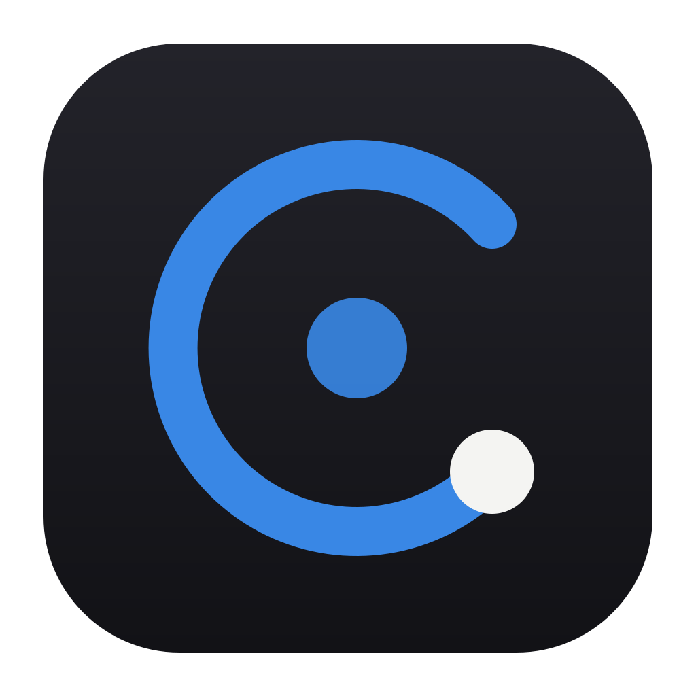
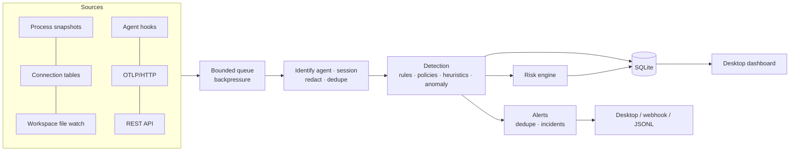

<p align="center"></p>

# Cortextrace

**See what AI agents are doing on your computer, and get told when it looks risky.**

Cortextrace is a local-first desktop app for Windows, macOS and Linux. It discovers AI coding agents and AI tools on your machine and traces every session: commands, file changes, tool and MCP calls, network destinations, approvals. It also runs a real-time detection engine that explains *why* something is risky. Nothing leaves your machine unless you configure an export.

| | |
|---|---|
| **Discovers** | Claude Code, Claude Desktop/Cowork, Cursor, Codex, Gemini CLI, GitHub Copilot (VS Code + CLI), Antigravity, Windsurf, Cline, Roo Code, OpenCode, Aider, goose, Amp, Kiro, Ollama, LM Studio, llama.cpp, ChatGPT Desktop, MCP server processes, Python/Node agent frameworks, unidentified processes calling LLM APIs, and your own custom agents |
| **Collects via** | process tree snapshots · network connection metadata · workspace file watching · native agent hooks (Claude Code, Cursor, Codex) · OpenTelemetry OTLP/HTTP · a local REST API |
| **Detects** | 39 tested rules (destructive commands, download-and-execute, reverse shells, credential access, persistence, security-control tampering, exfiltration, prompt injection, tool poisoning, …), your policies, behavioural heuristics (mass changes, secret-access-then-egress, denied-then-executed) and learned activity baselines |
| **Explains** | per-session and per-agent risk scores (0–100) broken down by 10 dimensions, each factor linked to its evidence |
| **Stores** | SQLite (WAL, indexed) with retention, integrity checks and JSONL/CSV export |

> Cortextrace is a defensive observability tool. It runs visibly (window and tray), needs no elevated privileges, never bypasses OS security controls and never collects file contents.

## Install

Download the installer for your platform from Releases:

| Platform | Package |
|---|---|
| Windows 10/11 | `Cortextrace-x.y.z-win-x64.exe` (per-user installer) or `.msi` |
| macOS 12+ | `.dmg` (Apple silicon / Intel) or universal `.pkg` |
| Linux | `.AppImage`, `.deb`, `.rpm` |

Launch it. The first-run guide shows exactly what is monitored and which agents it found, and lets you connect hooks. See [docs/INSTALL.md](docs/INSTALL.md).

## Build from source

Requires Node.js 24+.

```bash
npm ci
npx electron scripts/icons.cjs   # one-time: render icons from build/logo.svg
npm run build                    # bundle main, preload and renderer into dist/
npm start                        # run the desktop app
```

| Command | What it does |
|---|---|
| `npm test` | unit, integration, API, collector and rule tests (`node --test`) |
| `npm run typecheck` | TypeScript, whole repo |
| `npm run e2e` | launches the app, drives synthetic agents over real HTTP hooks/OTLP, screenshots every page, fails on renderer errors |
| `npm run bench` | ingestion throughput, sustained 12k events/min, query latency |
| `npm run engine -- --data-dir ./data` | headless engine (no UI): collectors + API + OTLP receiver |
| `npm run synthetic -- --agents 20 --rate 3000` | generate safe synthetic agent traffic against a running instance |
| `npm run dist:win` / `dist:mac` / `dist:linux` | build installers into `release/` |
| `npm run licenses` | regenerate THIRD_PARTY_NOTICES.md and fail on non-permissive licenses |

## How it works



Read [docs/ARCHITECTURE.md](docs/ARCHITECTURE.md) for the full design, [docs/EVENT_SCHEMA.md](docs/EVENT_SCHEMA.md) for the event model and [docs/ADAPTERS.md](docs/ADAPTERS.md) to add an agent.

## Documentation

- [Installation](docs/INSTALL.md) · [Privacy](docs/PRIVACY.md) · [Threat model](docs/THREAT_MODEL.md)
- [Architecture](docs/ARCHITECTURE.md) · [Event schema](docs/EVENT_SCHEMA.md) · [Detection & risk](docs/DETECTION.md)
- [Adapters, custom agents & API](docs/ADAPTERS.md) · [Design decisions](docs/DECISIONS.md)
- [Releasing & code signing](docs/RELEASING.md) · [Contributing](CONTRIBUTING.md) · [Security policy](SECURITY.md)

## Product release document

The illustrated product release document for 0.1.0 is in [`product-release/`](product-release/):
[PDF](product-release/Cortextrace_Product_Release_Document_v0.1.0.pdf) ·
[Word](product-release/Cortextrace_Product_Release_Document_v0.1.0.docx).

## Maintainer

Cortextrace is created and maintained by **Manjunatha M** at [AI and ML consultants](https://aiandmlconsultants.com/).

- Email: [Manjunatha@aiandmlconsultants.com](mailto:Manjunatha@aiandmlconsultants.com)
- Issues and feature requests: [GitHub Issues](https://github.com/manjunatha552355-rgb/cortextrace/issues)
- Security reports: see [SECURITY.md](SECURITY.md) (please do not open public issues)

## License

Apache-2.0 — Copyright 2026 Manjunatha M, AI and ML consultants. Third-party components are listed in [THIRD_PARTY_NOTICES.md](THIRD_PARTY_NOTICES.md).
