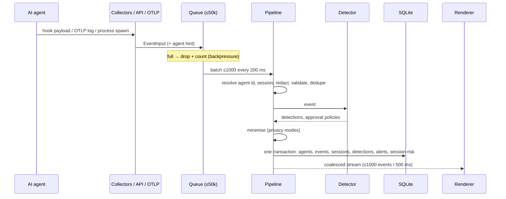
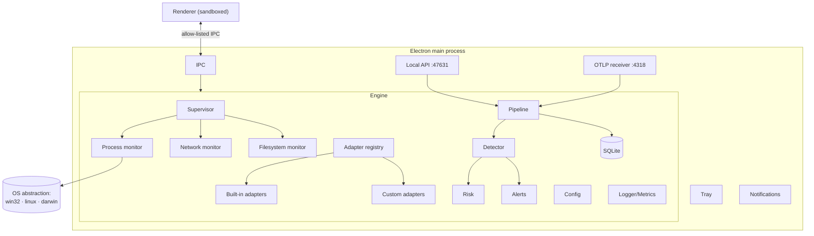

# Architecture

Cortextrace is a single TypeScript codebase that runs in two hosts:

- **Desktop**: an Electron main process. It hosts the engine, the local API and the OTLP receiver. A sandboxed React renderer talks to it through an allow-listed IPC bridge.
- **Headless**: `node src/cli.ts`. Same engine and API with no UI, used for servers, CI and tests.

The engine does not depend on Electron. Every subsystem can be tested with plain `node --test`.

## Repository layout

| Path | Component(s) |
|---|---|
| `src/core/schema.ts` | Event schema (versioned, zod-validated), severities, risk dimensions |
| `src/core/engine.ts` | Event bus / pipeline, correlation, query engine, export engine, analytics |
| `src/core/config.ts` | Configuration manager (validated, atomic writes, prototype-safe merge) |
| `src/core/redact.ts` | Secret/PII redaction |
| `src/core/observe.ts` | Diagnostic logger (rotating) and self-metrics |
| `src/collectors/os.ts` | OS abstraction: process list, connections, cwd for Windows / Linux / macOS |
| `src/collectors/process.ts` | Process monitor + agent discovery + network metadata monitor |
| `src/collectors/filesystem.ts` | Workspace filesystem monitor |
| `src/collectors/supervisor.ts` | Collector isolation, scheduling and exponential backoff |
| `src/adapters/` | Runtime adapter layer, adapter registry, built-in adapters, OTLP normalizer, MCP inventory |
| `src/detection/rules.ts` | Deterministic threat rules (with embedded test examples) |
| `src/detection/policy.ts` | Policy engine |
| `src/detection/detector.ts` | Layered detection: rules → policies → heuristics → anomaly |
| `src/detection/risk.ts` | Explainable risk engine |
| `src/detection/alerts.ts` | Alerting: dedupe, suppression, incidents, webhook, JSONL log |
| `src/storage/db.ts` | Local storage (SQLite), migrations, retention, integrity |
| `src/api/` | Local HTTP API, OTLP receiver, OpenAPI document |
| `src/main/` | Desktop shell: window, tray, notifications, login item, IPC |
| `src/renderer/` | Dashboard UI (React) |
| `src/synthetic/` | Safe synthetic agent traffic generator |
| `tests/` | Unit, integration, API, collector, rule and performance tests |
| `scripts/` | Build, icons, E2E, license audit |
| `build/`, `electron-builder.yml` | Packaging |

## Data flow

### Pipeline stages

1. **Collection.** Each collector is independent and scheduled by the `Supervisor`. A collector that throws is marked *degraded* and backed off (interval × 2ⁿ, up to 5 min). Its siblings keep running.
2. **Identity.** `agent_id = <adapter id>@<host id>`: one identity per agent product per machine. Each running root process, hook session or OTLP conversation becomes a **session**.
3. **Redaction.** Payloads are deep-scanned for secret formats and sensitive keys before anything else sees them. The labels of what was found are kept; the values are not.
4. **Validation.** Every event is parsed against the zod schema. Invalid events are dropped and counted.
5. **Deduplication.** The same action can arrive three ways: a hook, an OTLP log, and the shell it spawns in the process snapshot. Hook-reported commands suppress matching process-snapshot commands within 30 s. OTLP tool events for the same session, tool and 3-second window are dropped. Hook-reported file edits suppress inferred file-watch events for 5 s.
6. **Detection.** See [DETECTION.md](DETECTION.md).
7. **Minimisation.** Prompts, tool output and command lines are reduced according to the privacy settings. This happens *after* detection so rules can scan content that is not retained.
8. **Persistence.** One SQLite transaction per batch.
9. **Streaming.** The main process coalesces batches and pushes them to the renderer only when its window is visible.

## Component diagram

## OS abstraction (`collectors/os.ts`)

| Capability | Windows | Linux | macOS |
|---|---|---|---|
| Process list (pid, ppid, exe, cmdline, start) | One long-lived PowerShell host running `Get-CimInstance Win32_Process` (~130 ms warm) | `/proc/*/stat`, `cmdline`, `exe` | `ps -axww -o pid,ppid,lstart,args` + `ps -o comm` |
| TCP connections per pid | `Get-NetTCPConnection` | `/proc/net/tcp{,6}` joined with `/proc/<pid>/fd` socket inodes (tracked pids only) | `lsof -nP -iTCP -sTCP:ESTABLISHED` |
| Process working directory | not available without debug privileges (documented limitation) | `/proc/<pid>/cwd` | `lsof -d cwd` |
| File change events | `fs.watch` recursive (ReadDirectoryChangesW) | `fs.watch` recursive (inotify) | `fs.watch` recursive (FSEvents) |

All of these run as the logged-in user with no elevation. Processes owned by other users may show partial metadata.

## Concurrency and limits

| Resource | Limit / behaviour |
|---|---|
| Ingest queue | 50,000 events; drops beyond that (counted as `events.dropped`) |
| Batch | 1,000 events or 200 ms |
| Renderer stream | ≤1,000 events per 500 ms, only while visible |
| Watched workspaces | 16 (configurable, max 128); never `/`, drive roots or the home directory |
| Tracked sessions in detector memory | evicted after 1 h idle once >5,000 |
| Timeline UI | virtualised lists; session timeline renders 2,000 rows, full data via export |
| Event payload strings | truncated at 4 KB after redaction |
| API bodies | hooks 1 MB, events 5 MB, OTLP 8 MB |

## Failure handling

| Failure | Behaviour |
|---|---|
| Collector throws | marked degraded, exponential backoff, other collectors unaffected, visible in System Health |
| Adapter throws | error counted per adapter; hook request returns 422; other adapters unaffected |
| Batch processing throws | batch dropped and counted, pipeline continues with the next batch |
| Database fails integrity check or cannot open | file moved to `cortextrace.db.corrupt-<ts>`, fresh DB created, banner shown in the UI |
| API/OTLP port in use | engine keeps running; UI banner explains which endpoint is unavailable |
| Invalid config.json | defaults used, file left untouched, error shown in Settings |
| Cortextrace not running while an agent calls a hook | curl times out after 3 s; the agent continues (fail-open) |

## Self-observability

`systemHealth()` exposes counters (received, stored, dropped, deduplicated, invalid, batch failures, API status codes), latency percentiles (pipeline, detection, storage, API, each collector), CPU %, RSS, heap, queue depth, collector and adapter health, a 1-hour ring of 10-second samples, and the last 500 log lines. Everything is shown on **System Health** and included, without events, in the diagnostics bundle.
