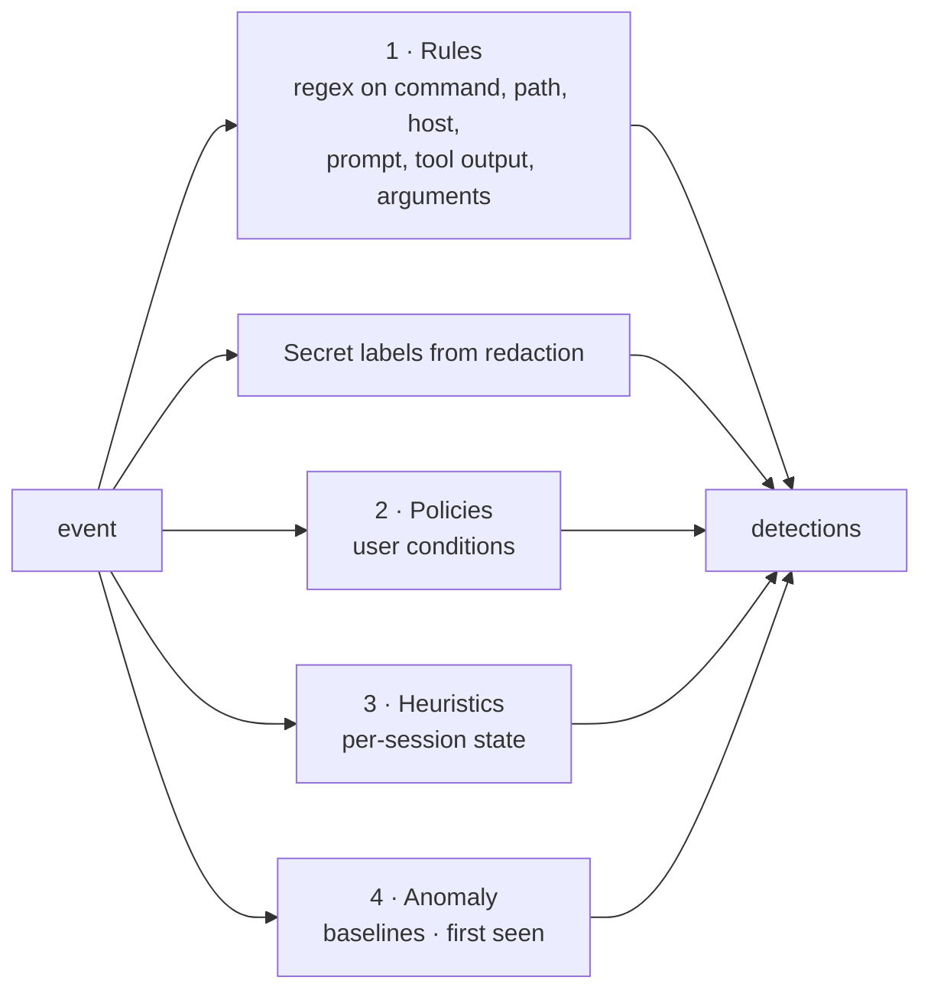

# Detection, policies and risk

## Principle

Nothing is labelled *malicious*. Each finding has a **classification**:

| Classification | Meaning | Example |
|---|---|---|
| `observation` | a fact worth recording | a package was installed; first contact with a new domain |
| `suspicious_indicator` | a pattern that often accompanies harm and needs human judgement | `curl … \| bash`, reading `~/.aws/credentials` |
| `policy_violation` | broke a rule *you* configured | access to `~/.ssh` when a policy forbids it |

Each finding also carries `severity`, `confidence` (0–1), `dimension`, `reason`, `evidence` (a snippet around the match, not the full payload), `recommended_action` and related event ids.

## Layers



1. **Rules** (`src/detection/rules.ts`). 39 rules in these groups: destructive, privilege, execution (download-and-execute, encoded, obfuscation, reverse shell, LOLBins), persistence, defense evasion, supply chain, credentials, exfiltration, sensitive files, agent control files, CI/IaC, network destinations, prompt injection, tool poisoning, hidden Unicode, markdown-image exfiltration, sensitive tool arguments. Every rule declares `examples.match` and `examples.no_match`, and `tests/rules.test.ts` runs them all.
2. **Secret exposure.** If redaction found a secret format in a tool result or command, `secret.exposed_in_activity` fires. The secret value itself is never stored.
3. **Policies** (`src/detection/policy.ts`). Conditions on dotted event fields using `equals`, `contains`, `matches`, `glob`, `in`, `not_in`, `gt`, `lt` and `exists`. Modes:
   - `observe`: INFO observation, no alert.
   - `alert`: policy violation at the configured severity.
   - `require_approval`: evaluated *synchronously* during the hook request. Claude Code and Codex `PreToolUse` get `permissionDecision: "ask"`; Cursor `before*` hooks get `permission: "ask"`. Runtimes without blocking hooks record a violation only.
4. **Heuristics** (`detector.ts`):
   - `behavior.mass_file_modification`: at least N changes in W seconds per session (default 60 in 60 s).
   - `behavior.mass_file_deletion`: at least N/3 deletions in the window.
   - `behavior.large_repository_change`: 200 distinct files changed in one session.
   - `sequence.secret_access_then_egress`: a credential indicator followed within 120 s by a non-allowlisted connection or an upload command.
   - `approval.denied_then_executed`: a denied command later executed in the same session.
5. **Anomaly and first-seen:**
   - `anomaly.event_rate`: per-agent-type events-per-minute baseline, kept as an exponentially weighted mean and variance and persisted in `baselines`. Fires when the current minute exceeds mean + z·σ (default z = 4). Requires at least 30 learned minutes and at least 50 events.
   - `network.unexpected_destination`: first connection per agent type to a destination not on the allowlist (LOW; MEDIUM for unusual ports).
   - `mcp.unknown_server`: first call to an MCP server that isn't in any scanned MCP configuration or the known list.

## Risk score

For each detection:

```
points = severity_points × confidence × class_weight
severity_points: INFO 0 · LOW 6 · MEDIUM 18 · HIGH 40 · CRITICAL 75
class_weight:    observation 0.5 · indicator 1.0 · violation 1.2
repeats of the same rule: 25% each, at most 3 repeats
score = min(100, Σ points_i × 0.7^rank_i)   (contributions sorted descending)
```

A single critical finding dominates, and many small findings still add up without saturating instantly. The same formula runs per risk dimension (command, filesystem, network, credential, privilege, persistence, data access, MCP/tool, anomaly, policy). Session risk covers the whole session. Agent risk covers the last 24 hours. Level thresholds default to low 15 / medium 40 / high 65 / critical 85 and are configurable. The session page shows every contributing factor with its points, confidence, classification and evidence.

## Alerts

- Created for detections at or above `alerts.min_severity` (default MEDIUM).
- **Dedupe key:** rule + session + normalised first evidence line (digits and hex ids removed). Repeats within `dedup_window_sec` increment a counter.
- **Incidents:** alerts for the same session within 30 minutes share an incident id.
- **Suppressions:** by rule id, optionally scoped to an agent type and an expiry time. Suppressed alerts are still stored.
- **Channels:** dashboard; desktop notification (≥ `notify_min_severity`, default HIGH); `alerts.jsonl` in the data directory (tail it into a SIEM); optional webhook (metadata only); optional OTLP export of all events.

## False-positive guidance

- Add trusted hosts to the network allowlist and trusted MCP servers to the known list.
- Disable individual rules in **Policies → Detection rules**.
- Suppress a rule per agent from the detection drawer.
- `cmd.supply_chain.package_install` and `file.infrastructure.modified` are observations by design.
