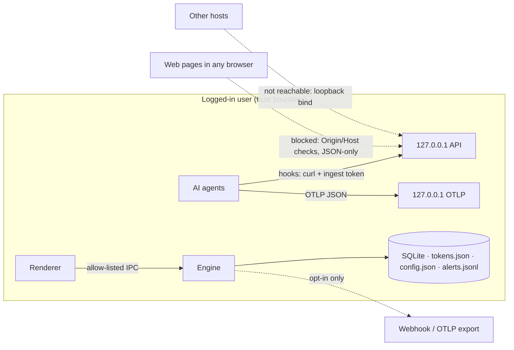

# Threat model

## What Cortextrace protects

1. **The user's visibility into AI agents**: an accurate, tamper-evident-enough local record of what agents did.
2. **The telemetry itself**: commands, paths and (optionally) prompts are sensitive. They must not leak.
3. **The host**: Cortextrace must not become a new attack surface or a privilege-escalation path.

## Assets and trust boundaries

## Adversaries and mitigations

| # | Adversary / scenario | Risk | Mitigation | Residual |
|---|---|---|---|---|
| T1 | Remote network attacker | reach the API | binds 127.0.0.1 only; no remote listener | none known |
| T2 | Malicious web page (CSRF / DNS rebinding against localhost) | inject fake events, read data | requests with any `Origin` header or `Sec-Fetch-Site: cross-site` rejected; `Host` must be loopback:port; bodies must be `application/json` (forces a CORS preflight that is never granted); bearer tokens on all non-OTLP routes | the OTLP port is unauthenticated for loopback clients (many agents cannot send headers); browsers cannot reach it (same checks) |
| T3 | Other local processes as the same user (including a compromised agent) | forge or suppress telemetry, read tokens, edit config | tokens and config files are 0600 on POSIX; ingest token is write-only; config changes are logged | **Out of scope to fully prevent.** Code running as the user can already read the user's files and kill the process. Cortextrace is a visibility tool, not a tamper-proof sensor. See Limitations. |
| T4 | Other local users | read telemetry | data lives in the user's profile; POSIX 0600 modes | on Windows, relies on profile ACLs |
| T5 | Agent tries to disable monitoring by editing its own hooks/settings | blind spot | `file.agent_control.modified` rule and `agent-self-configuration` policy; integration status shown in Settings | edits made outside watched workspaces or before start are not seen |
| T6 | Secrets leaking into the Cortextrace DB | secondary exposure | redaction before persistence, prompts metadata-only by default, no file contents, 4 KB string cap, MCP env values never read into storage | novel secret formats may be missed; add custom patterns |
| T7 | Malicious hook/OTLP payloads (DoS, injection) | crash, memory exhaustion, SQL/XSS injection | zod schema validation; body caps (1–8 MB); rate limiting; bounded queue with drop; parameterised SQL everywhere; React escapes all rendered text; strict CSP (`script-src 'self'`, `connect-src 'none'`) | a local process can still flood up to the rate limit |
| T8 | Renderer compromise (e.g. via crafted event text) | escalate to Node | `contextIsolation`, `sandbox`, `nodeIntegration: false`, allow-listed IPC channels with argument validation, sender URL check, navigation and window-open blocked, all permission requests denied | Electron/Chromium 0-days |
| T9 | Supply-chain compromise of dependencies | code execution | runtime deps are few (zod, d3-force, react) and bundled at build time; `npm audit` and a license gate in CI; lockfile | ongoing |
| T10 | Tampered installer | code execution | CI builds with SHA256SUMS; Authenticode and Apple notarization supported (see RELEASING.md) | unsigned community builds |
| T11 | Detection evasion by a deliberately malicious agent (obfuscation, short-lived processes, direct syscalls) | missed detections | multiple independent sources (hooks + process + network + fs); obfuscation/encoding rules; hooks capture commands before execution | polling misses sub-interval processes; no kernel telemetry; see Limitations |
| T12 | Cortextrace used as spyware | privacy harm | always visible (window + tray), onboarding discloses every data source, pause control, no stealth mode, no remote upload by default, monitors agent processes, not the user's general activity | an administrator with local access could configure exports; exports are visible in Settings |

## Explicit non-goals

- Kernel-level or EDR-grade tamper resistance (no drivers, no system extensions, no eBPF).
- Blocking arbitrary agent actions outside runtimes that expose approval hooks.
- Protection against an attacker who already has code execution as the same user.

## Limitations that affect security conclusions

- Process polling (default 5 s) misses processes that start and exit between snapshots. Hooks cover this for integrated agents.
- File-change attribution is inferred from workspace ownership. Another process writing in the same workspace is credited to the agent session (marked `inferred`).
- Windows does not expose other processes' working directories without debug privileges, so process-only sessions on Windows have no workspace.
- Local events can be forged by any same-user process that has the ingest token (or via the OTLP port).
